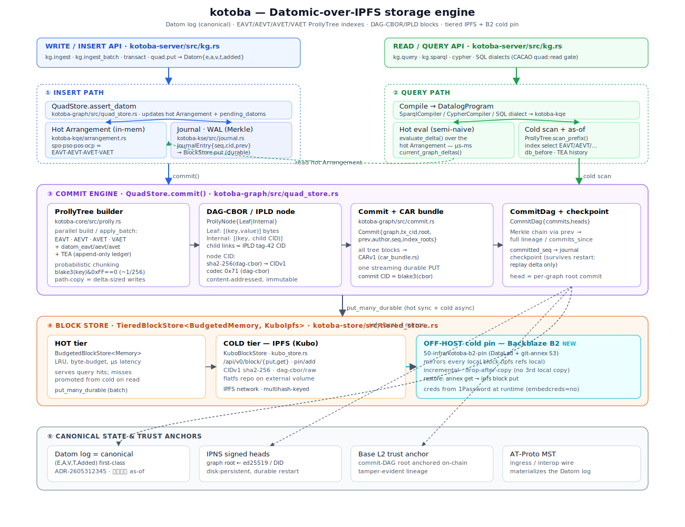

# kotoba

**A capability-safe language _and_ a content-addressed distributed Datalog database**

```
KOTOBA ≝ Datom[CID/T] × EAVT[KSE Topic] × Pregel[BSP] × Datalog[Δ]
          × CACAO × AT Protocol × LLM/Weight × WASM/WIT × safe Kotoba[cap⊗effect]
```

Kotoba is two things in one system:

- **A database** — a distributed, content-addressed knowledge graph for
  decentralized AI agent systems, combining Datomic-style immutable datoms,
  Pregel BSP graph computation, an auxiliary SPARQL 1.1 executor over IPFS
  storage, native CACAO authentication, and WASM Component Model execution.
- **A language** — `kotoba-lang` defines the source profile (`.kotoba`
  canonical, portable `.cljc` with `#?(:kotoba ...)` for Kotoba-specific
  branches), and `kotoba wasm` compiles that Kotoba/EDN subset directly to
  **WebAssembly** (a compiler, not an interpreter). **safe Kotoba** adds a
  *capability-confined* profile for running untrusted / AI-generated agents:
  what a module can touch is whatever it was explicitly handed, and nothing
  else. See [**Language**](#language--kotoba-lang--kotoba-wasm) below.

## Repository boundary

`kotoba-lang/kotoba` is the language and library substrate. Keep generic
protocols, data structures, compilers, runtimes, storage, crypto, and reusable
fixtures here. The split policy is recorded in
[`docs/ADR-repository-boundaries.md`](docs/ADR-repository-boundaries.md).

`kotoba-lang/kotoba-lang` owns the standalone language and public CLI contract.
This repository keeps host implementations, integration tests, and legacy Rust
adapters while they are migrated to consume the CLJC/EDN authority there.

The Rust `kotoba` crate/CLI is an integration adapter over multiple workspace
crates. It is no longer the semantic authority for the public CLI. New command
shape belongs in `kotoba-lang/kotoba-lang`, and host launchers should delegate
to that CLJC contract.

`kami-engine` is the strongest future split candidate when the Kami host,
rendering/devtool SDK, templates, and golden UI verification can build without
`kotoba-kotodama` path dependencies. After that split, this repository should
keep only thin WIT/component fixtures and integration tests for Kami surfaces.

Domain actors do not belong in this repository. They live in
`etzhayyim/com-etzhayyim-*` as `.cljc` actors/cells. AT Protocol actors,
PDS/AppView handlers, and XRPC application surfaces live in
`gftdcojp/app-aozora`. Hosting, placement, fleet, gateway, and runtime
operations live in `kotoba-lang/murakumo`.

The historical `crates/kotoba-kotodama` tree is migration-only. Its generic Rust
config/inference crates may stay only when they are language/runtime substrate;
domain cells, Python UDF pools, AT Protocol actors, and hosting code are being
moved to their canonical owners.

## 📺 Explainers & Docs site

A static documentation site (landing page + **two interactive, auto-playing
explainer videos** with Japanese narration) lives under [`docs/`](docs/) and is
published via GitHub Pages:

> **🌐 [com-junkawasaki.github.io/kotoba](https://com-junkawasaki.github.io/kotoba/)**

| explainer | what it covers |
|---|---|
| **Part 1 — [Datomic × IPFS × Prolly Tree](https://com-junkawasaki.github.io/kotoba/explainer/kotoba-datomic-ipfs-explainer.html)** | how a Datomic-style query runs over a Prolly-Tree index that is DAG-CBOR/IPLD content-addressed and pinned to IPFS — write → 4-index build → CID → CommitDag → query `scan_prefix` → result provenance CID |
| **Part 2 — [Query / CACAO / Signal](https://com-junkawasaki.github.io/kotoba/explainer/kotoba-query-auth-signal-explainer.html)** | complex/large queries (BGP join, MaterializedView), multihop (property paths, Pregel BSP), federation (`SERVICE`), the transact write path, CACAO auth/authz (depth-2 delegation), and Signal E2E (X3DH → Double Ratchet) + t-of-N custody |

> These are self-contained HTML (open the Pages links above, or open the files
> in [`docs/explainer/`](docs/explainer/) directly in a browser). GitHub does not
> render the interactive HTML inline in this README. Every claim is grounded in
> the actual source (`prolly.rs`, `arrangement.rs`, `cacao.rs`, `delegation.rs`,
> `x3dh.rs`, `ratchet.rs`, `shares.rs`).

See [**Documentation**](#documentation) below for the full ADR / design index.

## Install

### Homebrew (macOS / Linux)

```bash
# Tap the kotoba formula
brew tap etzhayyim/kotoba          # one-time
brew install kotoba                # installs the CLJC/EDN-backed `kotoba` launcher
```

To track the upstream `main` branch instead of the latest tagged release,
add `--HEAD`:

```bash
brew install --HEAD kotoba
```

Or, install the formula directly from this repo without tapping:

```bash
brew install --build-from-source ./Formula/kotoba.rb
```

### From source (any platform)

```bash
git clone https://github.com/kotoba-lang/kotoba.git
cd kotoba
bin/kotoba-clj check --kind cli-contract --json
```

### Rust-free CLJ launcher

The CLJ launcher delegates to `kotoba-lang/kotoba-lang`'s CLJC CLI authority
instead of adding new Rust command semantics:

```bash
clojure -M -m kotoba.launcher check --kind cli-contract --json
bin/kotoba-clj deploy --manifest package-manifest.edn --target dev
```

Side-effecting commands return EDN/JSON data for host adapters. They do not
invent independent Rust behavior.

### Legacy Rust adapter

The Rust CLI remains available for existing server/database workflows while the
host implementation is being retired:

```bash
cargo install --locked --path crates/kotoba-cli --bin kotoba
```

## Quick start

The full IPFS + CACAO + Datomic/Datalog stack, with SPARQL as an auxiliary
query surface, runs as four single-shot commands:

```bash
# 1. One-time: generate Ed25519 + X25519 + DID, persist to macOS Keychain
#    (or ~/.etzhayyim/kotoba.env on Linux/other, chmod 600).
kotoba init

# 2. Start the server. IPFS cold tier + CACAO Private-default are ON by
#    default.  Add KOTOBA_PEERS="http://p1:5001 http://p2:5001" to fan-out
#    across multi-peer DistributedBlockStore.
kotoba serve &

# 3. Smoke-test: ingest a sample entity and run all four SPARQL forms
#    (SELECT / DESCRIBE / CONSTRUCT / ASK) through the direct-SPARQL endpoint.
kotoba demo

# 4. HTTP loadtest the running server.  `--cacao-seed <hex>` runs the bench
#    through the full CACAO + Private-graph path with fresh nonces per request.
kotoba bench --iters 1000 -c 16 'SELECT * WHERE { ?s <kg/claim/role> "admin" }'
```

Bare CLI features:

```bash
kotoba whoami                                    # print resolved config
kotoba sparql 'ASK { ?s <kg/claim/role> "admin" }'
kotoba sparql 'DESCRIBE <cid:abc...>' --cacao <b64>
kotoba cypher 'MATCH (a)-[r]->(b) RETURN a, b'
kotoba health                                    # ping /health
```

CACAO ecosystem helpers:

```bash
kotoba did-derive <32-byte-hex-seed>             # → did:key:z…
kotoba cacao-sign <seed> --graph <cid> \
    --capability datom:read [--private] [--aud <did>]
```

## Language — kotoba-lang & kotoba wasm

## 言語性（Language-ness）

`kotoba` の言語性は、単なる「シンタックス定義」ではなく、次の3点で成立しています。

1. **言語契約の明示化**  
   `.kotoba` が正規ソース契約、`.clj/.cljc/.cljs` が互換入力という優先順位付きの入力面を持つ。  
   `#?(:kotoba ...)` と名前空間解決ルールで、Rust 実装に依存しない公開仕様として運用します。

2. **コンパイルの主権移譲**  
   `kotoba wasm` / `kotoba -e` は `kotoba-lang` の言語面をコンパイラ API として明示し、最終的に
   **WASM Component** として発行します。実行環境は AST ではなく、コンパイル済みバイナリで評価されます。

3. **実行可能性の拘束化**  
   `safe` プロファイルは「言語で強く動く」ではなく、**許可されたものしか実行できない** という意味論で安全性を定義します。  
   capability/subset/effect の3ゲートは、実行前に入口で拒否され、`allow-by-default` ではない言語挙動を採用します。

この `言語性` は `docs/lang/` 配下のプロフィール・互換性仕様と、`docs/ADR-kotoba-lang-profile.md` / `ADR-safe-capability-language.md`
（および `ADR-kotoba-wasm.md`）で追跡しています。

kotoba is not only a database — it ships its **own language profile**.
[`kotoba-lang`](crates/kotoba-lang/) defines the source contract: `.kotoba` is
the canonical Kotoba source extension, portable `.cljc` is for shared
Clojure-family source, `.clj` / `.cljs` are compatibility inputs, and
`#?(:kotoba ...)` selects Kotoba-specific code.
`kotoba wasm` compiles that profile's Kotoba/EDN subset directly to **real
WebAssembly**: the Kotoba source *becomes* a WASM Component that runs on
`kotoba-runtime` against the `kotoba:kais` host world (graph read/write,
streams, LLM inference, CACAO). `.clj` / `.cljc` / `.cljs` remain compatibility
inputs, but `.kotoba` is the canonical source extension. It is a compiler, not
an embedded interpreter.

The public CLI path is `kotoba wasm`: it exposes build, safe-build, safe-policy,
and selfhost inspection over the same compiler APIs without making callers speak
the implementation crate name. The language gate also pins that public surface:
`kotoba -e`, `kotoba wasm build`, `safe-policy`, `selfhost-inspect`, and
`safe-build` all default to the `kotoba` reader target, accept `-S` /
`--source-path`, and keep `.kotoba` namespace sources ahead of `.clj`
compatibility files. On top of the compiler, **safe Kotoba**
(`compile_safe_kotoba`, legacy alias `compile_safe_clj`) is a *capability-confined*
profile for running untrusted / AI-generated code. The thesis (see
[`docs/ADR-safe-capability-language.md`](docs/ADR-safe-capability-language.md)):
the strongest safety is not a "strong language" but **an execution environment
where an attacker can do nothing it was not explicitly handed**. safe Kotoba
enforces that with three deny-by-default gates, all at compile time:

| Gate | Guarantee | Theorem |
|---|---|---|
| **Capability** (`policy.rs`) | a module's wasm import section ⊆ the policy's grants — an ungranted host capability is *physically absent* from the emitted bytes, so the runtime can never bind it | **T3 — Capability Confinement** |
| **Subset** (`subset.rs`) | no `eval`, no runtime `require`/`import`, no dynamic-var mutation (`set!`/`binding`), no reflection, no unrestricted `defmacro` — constructs the legacy path silently drops are rejected | no ambient code/effect |
| **Effect** (`effects.rs`) | a function may not perform an effect outside its declared `{:effects …}` row — checked **interprocedurally** (a write cannot hide behind a helper; mutual recursion converges) | **T2 — Effect Soundness** |

Capabilities are passed as **values**, never summoned by name: a module not
handed write access to a graph cannot write it — the same attenuation CACAO
enforces at run time, lifted into the type/compile layer. The policy is
deny-by-default EDN (`crates/kotoba-clj/examples/safe-policy.edn`):

```edn
{:imports {:graph-read ["bafy…"] :graph-write ["bafy…"] :infer [] :auth false}
 :limits  {:memory-pages 4 :fuel 1000000 :max-output-bytes 65536}}
```

Build a confined module from the CLI — and audit exactly what it can do:

```bash
kotoba -e '(+ 1 2)'                         # compile Kotoba -> Wasm -> run main
kotoba wasm safe-build cell.kotoba --policy policy.edn -o cell.wasm
# [wasm safe-build] cell.kotoba (10405 bytes)
# [wasm safe-build] admission gate: selfhost/kotoba
# [wasm safe-build] capability surface: kotoba:kais/kqe@0.1.0
# [wasm safe-build] inferred effects: run={graph-write}
```

`--selfhost-gate` is retained only as a compatibility alias; safe-build and
safe-policy are selfhost-first by default.

To inspect the versioned analyzer request and selfhost summaries without
compiling, use:

```bash
kotoba wasm selfhost-inspect cell.kotoba --policy policy.edn --request-hex --json
# {
#   "abi": "kotoba.selfhost.safe-analyzer.v1",
#   "types": {"ok": true, "denials": []},
#   "admission": {"effects": {"ok": true}, "policy": {"ok": true}},
#   "functions": [{"name": "run", "effects": ["graph-write"]}]
# }
```

Capabilities are scoped **per resource**: granting write to graph A does not
permit graph B, and granting inference on model M does not permit model N — the
compile-time twin of CACAO's `leaf.graph ⊆ root.graph` attenuation (T3 at
instance granularity). `kotoba wasm safe-policy <cell>` runs the inverse of the
gate, synthesizing the **minimal least-privilege policy** a cell needs.

Audit/tooling APIs, usable standalone: `embedded_capability_ifaces(wasm)`
(byte-level capability surface), `infer_effects(src)` (source-level transitive
effects), `minimal_policy(src)` (least-privilege synthesis), `Policy::to_edn`.
Self-hosting has started in slices under
[`crates/kotoba-clj/selfhost/`](crates/kotoba-clj/selfhost/): the
`safe_analyzer.kotoba` seed is written in Kotoba, compiles as safe Kotoba to a
Wasm Component, has no embedded host capability imports, and is checked against
the Rust analyzer for the covered effect/capability/policy surface. Rust callers
can exercise that path through `kotoba_clj::selfhost::{Analyzer,
infer_effects, minimal_policy, check_effect_declarations, check_policy,
check_admission, unused_grants, compile_safe_kotoba}`. Status:
capability (instance-level), subset, and effect (interprocedural) gates
implemented and byte-verified (S0–S4) with safe-mode tests; typed HIR / borrow
checker (T1) and wider self-hosting are tracked in the ADRs.

Current naming: `kotoba` is the language + database + semantic substrate,
`kotoba wasm` / safe Kotoba is the executable language path that turns Kotoba
into Wasm, and `aiueos` is the OS/component supervisor and capability broker.
`kotoba-clj` remains the implementation crate for that compiler path. In that
split, Rust-free self-hosting means moving authoritative language/admission
semantics into confined Kotoba components slice by slice, while Rust remains
the bootstrap/emitter/oracle for unfinished slices.

## Defaults that just work

| Knob                       | Default                                                  | Override                       |
|----------------------------|----------------------------------------------------------|--------------------------------|
| Cold tier                  | `KuboBlockStore` against `KOTOBA_IPFS_ENDPOINT`          | `KOTOBA_IPFS=off`              |
| IPFS endpoint              | `http://localhost:5001`                                  | `KOTOBA_IPFS_ENDPOINT=…`       |
| Multi-peer federation      | none (single-node)                                        | `KOTOBA_PEERS="http://… http://…"` |
| Default graph visibility   | `Private { owner_did = operator_did }` (CACAO required)  | `KOTOBA_DEFAULT_VISIBILITY=authenticated\|public\|private` |
| Agent identity             | macOS Keychain → `~/.etzhayyim/kotoba.env` → env → ephemeral  | `kotoba init`                   |

`kotoba serve` boots with a clear startup probe: if `ipfs daemon` is not
reachable on `KOTOBA_IPFS_ENDPOINT`, you get a single WARN line telling you
exactly how to silence or fix it.

## Crates

| Crate              | Role                                                                       |
|--------------------|----------------------------------------------------------------------------|
| `kotoba-core`      | CIDv1 dag-cbor sha2-256, KAIS 8-bit frame, Prolly Tree                     |
| `kotoba-kse`       | Journal (Merkle WAL), Vault (CDC chunker), Topic, Shelf, AgentIdentity     |
| `kotoba-query`       | Datalog engine, Arrangement (EAVT/AEVT/AVET/VAET), Delta, MV               |
| `kotoba-dht`       | Source Chain, Warrant, Neighborhood (DHT)                                  |
| `kotoba-net`       | libp2p QUIC/Noise/GossipSub                                                |
| `kotoba-auth`      | CACAO chain (depth-2), multi-graph grants, EdDSA verify, did:key, Passkey  |
| `kotoba-graph`     | Datom projection API, SPARQL 1.1 (BGP/Filter/Union/Optional/Group/Path/Service/…), Datalog cold, CID-MV cache, Commit DAG, N-hop DESCRIBE |
| `kotoba-vm`        | Invoke/Result ChainEntry, CALL_FOREIGN bridge                              |
| `kotoba-llm`       | Weight blob (FP8), LoRA Delta, KV-cache, WebGPU train + infer (Gemma 4)     |
| `kotoba-runtime`   | WASM Component Model host: WasmExecutor + UdfExecutor + WIT bindings       |
| `kotoba-store`     | BlockStore: Memory, Kubo HTTP, BudgetedBlockStore LRU, TieredBlockStore, DistributedBlockStore multi-peer |
| `kotoba-store-web` | Browser IndexedDB block store (wasm32)                                     |
| `kotoba-crypto`    | AEAD (AES-256-GCM), HKDF, key wrap                                         |
| `kotoba-signal`    | Signal Protocol (X3DH + Double Ratchet + MLS)                              |
| `kotoba-ingest`    | Gmail OAuth2 poll + RFC 2822 parse + E2E encrypt → Datom projection        |
| `kotoba-server`    | XRPC / MCP endpoints (kg.ingest / kg.ingest_batch / kg.query / kg.sparql)  |
| `kotoba-cli`       | `kotoba` binary (init, serve, demo, bench, sparql, …)                      |
| `kotoba-guest`     | WASM guest SDK (WIT bindings for kotoba nodes)                             |
| `kotoba-edn`       | SSoT EDN reader (Clojure/Datomic wire format) — the shared data/source reader |
| `kotoba-lang`      | **the language profile**: `.kotoba` source contract, `#?(:kotoba ...)` reader target, fixtures, and conformance gates |
| `kotoba-clj`       | Kotoba/EDN subset → WebAssembly compiler implementation, plus **safe Kotoba** (`compile_safe_kotoba`, legacy `compile_safe_clj`) — capability / subset / effect gates for confined, untrusted-safe modules |

## Properties

- **Content-addressed** — IPFS-compatible CIDv1 sha2-256 over raw / dag-pb / dag-cbor blocks
- **Immutable datoms** — Datomic-style 5-tuple `(E,A,V,T,Added)` with retract tombstones
- **5-index arrangement** — EAVT / AEVT / AVET / VAET / TEA for O(1)–O(log n) access
- **Prolly Tree storage** — deterministic, hash-consistent B-tree over blocks
- **Distributed Pregel** — BSP graph computation across nodes via libp2p
- **AT Protocol native** — Datom projection backed by commit DAG and JetStream
- **WASM runtime** — arbitrary graph logic as Component Model guests
- **Capability-safe language** — `kotoba wasm` compiles Kotoba/EDN → WASM; **safe Kotoba** confines untrusted/AI-generated modules by deny-by-default capability, subset, and (interprocedural) effect gates — capability confinement (T3) and effect soundness (T2)
- **E2E encryption** — Signal Protocol + CACAO auth for consent-gated data
- **Datomic/Datalog primary, SPARQL auxiliary** — the distributed Datom DB is the source of truth; SPARQL 1.1 reads the same projection for RDF-compatible query and federation
- **CACAO-native authz** — depth-2 delegation chains, multi-graph grants, anti-replay nonce
- **X-Road-style accountability** — ciphertext-only replication, purpose-declared + signed + receipted key release via t-of-N custodians, anchored tamper-evident audit log, slashable unreceipted releases. See [`docs/SECURITY-ARCHITECTURE.md`](docs/SECURITY-ARCHITECTURE.md)

## Architecture

The canonical spine is one content-addressed chain — **Datom log → ProllyTree
indexes → CommitDag → blocks** — with IPFS and B2 as export tiers, not the
system of record:



**① Canonical write path** — `kg.ingest`/`transact` →
`QuadStore::assert_datom` (`kotoba-graph/src/quad_store.rs`) records the exact
5-tuple `Datom{e,a,v,t,added}` in `pending_datoms`; a short window later
`commit()` builds the EAVT/AEVT/AVET/VAET (+ `datom_*` + append-only **TEA**)
**ProllyTrees** (`kotoba-core/src/prolly.rs`) — probabilistic chunking
(`blake3(key)&0xFF==0`) + path-copy so each commit writes only the delta; nodes
are **DAG-CBOR/IPLD** (`Internal [(k, child-CID)]` tag-42 links) addressed by
`sha2-256(dag-cbor) → CIDv1`. Blocks pack into one **CARv1** bundle and a
`Commit{root,index_roots,prev,seq}` block is appended to the **CommitDag**.
**The CommitDag is the write-ahead log** — an immutable, parent-linked,
content-addressed chain whose durability boundary is the atomic head-ref update
(git / Datomic semantics); restart loads the head + checkpoint and walks commits
since, no second-log replay.
> Pruned (per [ADR-2606041151](../../90-docs/adr/2606041151-kotoba-commitdag-as-wal-and-incremental-query-tier.md)):
> the old per-assert **Journal WAL** (4-topic double-write) and **Kubo-as-durable-tier**
> — the CommitDag already is the WAL; the Journal was a redundant double-write and the
> ~30 s startup-replay bottleneck.

**② Query — Datomic first-tier** — the 4-index model is tier-1: BGP routing does
direct index scans (EAVT point lookup ~180 ns, AVET, VAET reverse) over the
ProllyTree, and an incremental **MaterializedView** (`kotoba-query/src/mv.rs`,
maintained per commit Δ) serves recurring/Datalog queries without re-evaluating
from scratch. `kg.sparql` (SELECT/ASK/DESCRIBE/CONSTRUCT/UPDATE/SERVICE) is the
auxiliary RDF surface over the same indexes; `db_before`/TEA give Datomic-style
`as-of` time travel. All queries run over the IPFS-backed substrate — the hot
Arrangement is only an optimisation (cache).

**③ Block store — kotoba is its own IPFS block store + pinner** — the durable hot
tier is an embedded, in-process store (direct disk, µs–ms) and kotoba holds pins
itself (a flag in its own store, no `pin/add` RPC), removing the HTTP-RPC hop
(~35× ingest). Sealed commits **export asynchronously**, off the hot path:
**Kubo IPFS** (bitswap + DHT; optionally a networked pin service for the donated
mesh) and an **off-host cold pin to Backblaze B2**
(`50-infra/kotoba-b2-pin`, DataLad + git-annex S3 — mirrors every block,
`restore` re-imports via `ipfs block put`,
[ADR-2606041130](../../90-docs/adr/2606041130-kotoba-b2-blockstore-cold-pin.md)).

**④ Anchors** — the **Datom log is the canonical state**
([ADR-2605312345](../../90-docs/adr/2605312345-kotoba-datom-first-class-canonical-state.md));
IPNS signed heads pin per-graph roots (durable across restart), Base L2 anchors
the commit-DAG root for tamper-evidence, and AT-Proto MST is the ingress/interop
wire that materializes the log.

## Query Surfaces

Primary query/write semantics are Datomic-style Datom APIs and Datalog over
the immutable `(E,A,V,T,Added)` history. SPARQL is intentionally a secondary
RDF-compatible query surface over that Datomic/IPLD head, not a competing
source of truth.

Server endpoint: `POST /xrpc/com.etzhayyim.apps.kotoba.graph.sparql`

Auto-detects the form from the leading keyword and dispatches to the
matching Datom-backed cold-path method:

- `SELECT` — BGP / Filter / Union / Optional / Sub-SELECT / VALUES / GROUP BY / HAVING / ORDER BY / LIMIT / OFFSET / Property paths `+ * ? ^ |` / Sequence
- `DESCRIBE` — explicit IRIs and `?var WHERE { … }` forms; parallel per-subject fetch
- `CONSTRUCT` — template instantiation from any WHERE pattern
- `ASK` — constant-time short-circuit on first match
- `UPDATE` — `INSERT DATA` / `DELETE DATA` / `INSERT/DELETE WHERE`
- `SERVICE <cid:remote-graph>` — federated query across content-addressed graphs

Every form has a CACAO-authed variant — pass `cacaoB64` in the request body.

## Performance

Measurements taken on M4 Mac, release build, `KOTOBA_IPFS=off`,
`kotoba bench` against `kotoba serve`.

### Ingest

| path                                | rate                       |
|-------------------------------------|----------------------------|
| `kg.ingest`        (single, HTTP)   | 28 entities/sec            |
| `kg.ingest_batch`  (1 batch × 1000) | **3981 entities/sec** (142×) |
| `kg.ingest_batch`  (10 × 1000)      | **5222 entities/sec** sustained |

### Query (unauthed, 2000-entity graph)

| query                                  | result_n | seq p50 | seq QPS | c=16 QPS |
|----------------------------------------|----------|---------|---------|----------|
| `ASK     ?s <role> "admin"`            | true     | 0.32 ms | 2586    | —        |
| `SELECT  ?s <role> "admin"`            | 666      | 11.3 ms | 21      | 398      |
| 2-triple JOIN role+score               | 1332     | 18.5 ms | 51      | —        |
| `GROUP BY role COUNT(*)`               | 2 grp    | 5.1 ms  | 183     | —        |
| `CONSTRUCT … WHERE role=admin`         | 666      | 5.9 ms  | 135     | —        |

### CACAO-gated (5000 entities, fresh CACAO per request, 100% success)

| query                          | result_n | seq p50 | seq QPS |
|--------------------------------|----------|---------|---------|
| `ASK`                          | true     | 0.68 ms | 1212    |
| `SELECT role=admin`            | 1667     | 11.5 ms | 71      |
| 2-triple JOIN role+dept        | 3334     | 41.0 ms | 23      |
| `GROUP BY role COUNT(*)`       | 2 grp    | 4.5 ms  | 189     |

### CACAO concurrency sweep (3000-entity graph)

| concurrency | QPS         | p50      |
|-------------|-------------|----------|
| 1           | 3916        | 0.20 ms  |
| 8           | 10113       | 0.52 ms  |
| 16          | 10140       | 1.27 ms  |
| 32          | **12753**   | 2.15 ms  |

Trust-boundary throughput **12.8K QPS** at c=32, 100% replay-protected.

## kotoba-shell release pipeline

`kotoba-shell` is the desktop/mobile app shell layer over safe-clj components
and the aiueos shell surface. It generates target-specific app scaffolds and
release evidence without requiring users to install global Node, wasmtime, or
platform runtimes.

```bash
kotoba shell check examples/kotoba-shell-hello/app.kotoba.edn
kotoba shell build examples/kotoba-shell-hello/app.kotoba.edn --target macos
kotoba shell export examples/kotoba-shell-hello/app.kotoba.edn --target macos
kotoba shell release-check --target macos target/kotoba-shell/release/macos/kotoba-shell-hello

kotoba shell build examples/kotoba-shell-hello/app.kotoba.edn --target windows
kotoba shell export examples/kotoba-shell-hello/app.kotoba.edn --target windows
kotoba shell release-check --target windows target/kotoba-shell/release/windows/kotoba-shell-hello
```

macOS release gates generate Developer ID signing and notarization helpers.
Windows release gates generate Authenticode signing and SmartScreen reputation
evidence helpers. The aiueos runtime boundary is explicit: `core` builds verify
and inspect manifests without `wasm-runtime`; `runner` builds include embedded
Wasm execution for app launch without a global runtime install.

Desktop exports also generate `aiueos-portable-plan.json`,
`build-aiueos-core.bb`, and `build-aiueos-runner.bb`. Set `AIUEOS_DIR` when the
aiueos checkout is not adjacent to the kotoba checkout.

## Documentation

The published docs site — [**com-junkawasaki.github.io/kotoba**](https://com-junkawasaki.github.io/kotoba/)
— is the entry point (overview, the two explainers, architecture, crates,
security, and this index). It is the static site under [`docs/`](docs/), served
by [`.github/workflows/pages.yml`](.github/workflows/pages.yml).

| doc | topic |
|---|---|
| [`docs/index.html`](docs/index.html) | docs-site landing page (hub) |
| [`docs/paper/`](docs/paper/) | arXiv-style research paper (LaTeX source) — full system description |
| [`docs/explainer/`](docs/explainer/) | the two interactive explainer videos |
| [`docs/SECURITY-ARCHITECTURE.md`](docs/SECURITY-ARCHITECTURE.md) | X-Road-style accountability, R0–R3 custody, threat model |
| [`docs/ADR-001-five-axis-distributed-redesign.md`](docs/ADR-001-five-axis-distributed-redesign.md) | five-axis distributed redesign |
| [`docs/ADR-sealed-cold-tier.md`](docs/ADR-sealed-cold-tier.md) | encrypted cold tier + t-of-N custody |
| [`docs/ADR-clojure-wasm.md`](docs/ADR-clojure-wasm.md) | Clojure/EDN-subset → WebAssembly compiler (the language) |
| [`docs/ADR-safe-capability-language.md`](docs/ADR-safe-capability-language.md) | **safe-clj** — capability-confined language design (capability/subset/effect gates, T2/T3) |
| [`docs/ADR-kotoba-shell-aiueos-safety-clj.md`](docs/ADR-kotoba-shell-aiueos-safety-clj.md) | kotoba-shell, aiueos runner integration, and release security gates |
| [`docs/lang/README.md`](docs/lang/README.md) | language profile (`.kotoba`/reader target), conformance fixtures, and gates |
| [`docs/ADR-browser-cid-query-vs-p2p.md`](docs/ADR-browser-cid-query-vs-p2p.md) | browser execution boundary |
| [`docs/ADR-wallet-actor-cljs.md`](docs/ADR-wallet-actor-cljs.md) | CLJS wallet actor and Ethereum library surface |
| [`docs/ADR-turn-relay.md`](docs/ADR-turn-relay.md) | pure-Rust TURN relay for WebRTC |
| [`docs/ADR-kotoba-word.md`](docs/ADR-kotoba-word.md) | word/root registry + capability boundary |
| [`docs/ADR-research-paper-arxiv.md`](docs/ADR-research-paper-arxiv.md) | arXiv paper as a grounded, derived artifact |
| [`docs/WASI-HTTP-EGRESS-XRPC-INGRESS.md`](docs/WASI-HTTP-EGRESS-XRPC-INGRESS.md) | I/O boundary (egress/ingress) |

The cross-cutting design SSoT remains the parent-monorepo ADR (see [ADR](#adr) below).

## Build

```bash
cargo build --workspace
cargo test --workspace                  # ~1184 tests pass
cargo build --release -p kotoba-cli     # final `kotoba` binary
```

Wallet actor/browser maturity gate:

```bash
cd crates/kotoba-wasm/web/cljs
npm run test:wallet:all                 # Node + pure + ADR/package-lock/CI/export + browser ESM smoke
```

The same wallet gate runs in CI as `Wallet CLJS maturity gate`.

## Coverage

```bash
./scripts/coverage.sh        # per-crate + total line/region coverage (lib tests)
./scripts/coverage.sh html   # browsable report at target/llvm-cov/html/index.html
./scripts/coverage.sh lcov   # lcov.info for CI / codecov upload
```

Requires `cargo install cargo-llvm-cov` and a rustup toolchain (the script pins
to `rustup run stable` because Homebrew rust ships no `llvm-tools`).

## ADR

Design decisions live in
[`90-docs/adr/2605240001-kotoba-cleanroom-architecture.md`](https://github.com/etzhayyim/etzhayyim-apps-etzhayyim/blob/main/90-docs/adr/2605240001-kotoba-cleanroom-architecture.md)
of the parent monorepo.  Section §27 captures the current SPARQL surface,
HTTP loadtest matrix, and operator-UX defaults.

## License

Apache-2.0 with the **etzhayyim Charter Compliance Rider v2.0** — see
[LICENSE](LICENSE), [NOTICE](NOTICE), and [CHARTER-RIDER.md](CHARTER-RIDER.md).
Acceptance of the Apache License 2.0 constitutes acceptance of the Rider
(Mission Charter ADR-2605192100; Rider ADR-2605192200 v2.0).
