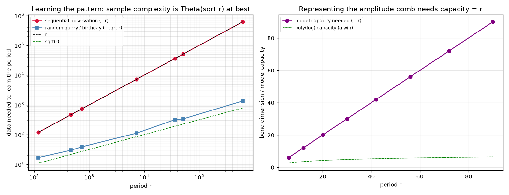
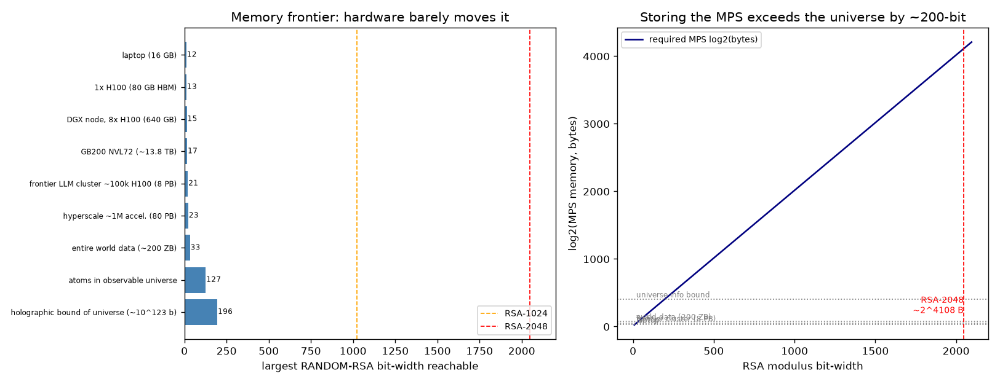

# Tensor-Network Simulation of Shor's Algorithm

A small, exact, dependency-light (numpy-only) implementation that turns the
"attack Shor with tensor networks" thesis into runnable experiments. It builds
the Shor order-finding wavefunction, represents it as a Matrix Product State
(MPS), and **measures** where the bond dimension lives, how it scales with the
period, and how much truncation the period-recovery can survive.

The headline finding is reproduced exactly:

> The modular-exponentiation step entangles the control and work registers
> across a **single cut**, and the Schmidt rank at that cut equals the period
> `r`. So an MPS needs bond dimension `χ = r` there — polynomial only when `r`
> is small. For hard RSA instances `r ~ N`, the bond dimension is exponential
> in the qubit count, and there is no classical win.

```
LAW across all 153 instances:  χ(control|work) == r   -> True
```

## What it does

`python3 run_demo.py` runs four experiments and writes `bond_vs_period.png`:

1. **Single instance** `N=15, a=7`: prepares `|x>|a^x mod N>`, applies the QFT as
   real 1- and 2-qubit gates on the MPS, samples the control register, recovers
   `r=4` by continued fractions, and factors `15 → 3 × 5`.

2. **Where does the bond dimension live? (Q4)** — modexp confines entanglement to
   one cut of rank `r`; it is the **QFT** that pushes bond dimension up across
   the control register.

   | N | a | r | qubits | χ@cut (=r) | maxBond modexp | peak bond QFT |
   |---|---|---|--------|-----------|----------------|---------------|
   | 15 | 7 | 4 | 12 | 4 | 4 | 4 |
   | 21 | 2 | 6 | 15 | 6 | 6 | 63 |
   | 33 | 2 | 10 | 18 | 10 | 10 | 130 |
   | 35 | 2 | 12 | 18 | 12 | 12 | 132 |

3. **Bond dimension vs period (Q3)** — a sweep over semiprimes `{15,21,33,35,39,51,55}`
   and every valid base `a` (153 instances) confirms `χ(control|work) == r` and
   entanglement entropy `== log2(r)` *exactly*.

4. **Truncation tolerance (Q5/Q6)** — cap the bond dimension to `χ` and ask
   whether sampling still recovers the period. Fidelity rises monotonically with
   `χ`; recovery survives down to `χ ≈ r` because Shor needs only **one** clean
   sample, and breaks once `χ` is small enough to smear the phase peaks away.

   ```
   N=21 a=2 (true r=6):
    chi   fidelity  r_hat  factored?
      1    0.15494   None      False
      2    0.41301   None      False
      3    0.54465      6       True
      6    0.94401      6       True
     16    0.99999      6       True
   ```


## Why this is the honest picture

This maps directly onto the design note's seven points:

- **§3 bond dimension decides everything** — verified: `χ@cut = r` exactly.
- **§4 RSA-general is hard** — for cryptographic `N`, `ord_N(a)` is typically
  `Θ(N)`, so the cut needs exponential bond dimension. The code shows the
  mechanism on small `N`; the scaling argument does the rest.
- **§5 attack directions** — (A) we use the actual circuit structure rather than
  a generic 1D chain; (B) we sample only the measurement outcomes we need
  instead of materialising the full state; (C) the truncation study quantifies
  how approximation trades fidelity for the all-important phase-peak sharpness.
- **§7 the circularity** — recovering the period from the MPS still requires a
  bond dimension that already encodes `r`. No free lunch.

## Pushing toward RSA scale

`python3 run_rsa_scale.py` takes the honest scaling story all the way up. The key
upgrade is a **gate-free, statevector-free** construction: the pre-QFT state
`|x>|a^x mod N>` is written *directly* as an MPS of bond dimension exactly `r`
(a finite-state automaton along the qubit chain — see `tnshor/scalable.py`).
Cost is `O((t+m)·r²)`, polynomial in qubit count and in the period.

**Result A — breaking the 2ⁿ wall.** When `r` is small (which we *engineer*, since
finding a small-order base for a given modulus requires its factorisation), Shor
also only needs a small control register `t ≈ 2·log₂ r`. We factor large
semiprimes by simulating Shor circuits far beyond any state-vector simulator:

| bits(N) | qubits n | state-vector would need | χ | factored | time |
|--------:|---------:|------------------------:|--:|:--------:|-----:|
| 48 | 61 | 2⁶¹ amps | 6 | ✓ | 0.4 s |
| 96 | 111 | 2¹¹¹ amps | 12 | ✓ | 1.4 s |
| 128 | 141 | 2¹⁴¹ amps | 6 | ✓ | 0.9 s |
| 160 | 173 | 2¹⁷³ amps | 6 | ✓ | 0.9 s |

A **160-bit semiprime factored via a ~173-qubit Shor circuit on a laptop in under
a second** — `2¹⁷³` amplitudes is utterly impossible to store; the MPS uses
kilobytes because χ = r.

**The two RSA walls (both measured, then extrapolated).**

- **Wall 1 — period.** For a *random* base, `r = ord_N(a) ~ Θ(N)`, so the
  control|work bond `χ = r` is exponential in the qubit count. Measured:
  `log₂(r)` tracks `log₂(N)`.
- **Wall 2 — QFT.** If you do *not* know `r` is small you must use the full
  `t = 2·log₂ N` register, and the QFT's **intermediate** bond dimension explodes
  `~2^{0.6t}` even though the input (χ=r) and output are low rank. Measured
  directly: peak QFT bond 32 → 1080 as `t` goes 8 → 20 at fixed `r=6`.


**Extrapolation to RSA-2048:** best case `χ ~ 2²⁰⁴⁷`, MPS `~2⁴¹⁰⁸` bytes — versus
`~2²⁶⁶` atoms in the observable universe. Classically impossible. Tensor networks
move the wall from *qubit count* to *period r* (plus QFT depth); RSA stays safe
because you cannot get a small-`r` handle, or shrink `t`, without already knowing
`p` and `q`.

## Analyzing actual RSA

`python3 analyze_real_rsa.py` applies the machinery to real RSA — without
pretending to break it. Three rigorous, runnable findings:

**1. The real RSA Challenge sizes.** Resource wall for RSA-100 … RSA-2048 (their
actual bit-lengths). RSA-2048 best case: `n = 6144` qubits, `χ ~ 2²⁰⁴⁷`, MPS
memory `~2⁴¹⁰⁸` bytes — versus `~2²⁶⁶` atoms in the universe. Not a hardware
problem; a mathematical impossibility for this representation.

**2. Empirical frontier on genuinely random keys.** No engineering — random
primes, random base, full `t = 2·log₂N`. The honest laptop frontier is **~10
bits**: a random base's order is `r ~ N`, so `χ = r` (and the full-`t` QFT bond)
blow a few-GB budget almost immediately. An 8-bit random key factors in ~12s with
peak QFT bond 1284 — the Wall-2 explosion biting even at 8 bits.

**3. Which real keys are vulnerable — vs Pollard p−1.** For two 64-bit keys:

| key | largest prime factor of p−1/q−1 | typical order r | TN χ=r | Pollard p−1 |
|-----|---:|---:|:---:|:---:|
| **strong** (safe primes) | ~2³¹ | ~2⁶¹ | infeasible | **fails** |
| **weak** (smooth p−1) | ~2¹² | ~2⁶¹ | infeasible | **factors in ms** |

The tensor-network "small-order" route needs a base built from `p,q` (circular);
the only blind large-key break is a **smooth `p−1`**, which classical Pollard
p−1 already does for free — and which safe-prime key generation avoids. So the
method's reach on real RSA equals the classical smooth-key reach, and adds
nothing on properly generated keys. Tensor networks re-express RSA's hardness as
"the period `r` is exponentially large" — which is exactly why RSA is secure.

## The learning framing: learn the period, identify the amplitude peaks

`python3 learn_period.py`. The intended design is not "build the state from a
known `r`" — it's to **learn the periodic pattern** of `aˣ mod N` and let a model
**identify where the amplitude peaks sit** (at `y ≈ s·Q/r`), recovering `r`
without knowing it. Taken at face value, a classical learner can touch the
problem through exactly three channels, and all three were measured:

| channel | what it costs | measured |
|---|---|---|
| observe the pattern sequentially | Θ(r) — first repeat of `aˣ` is at `x=r` | window = r exactly |
| query at random `x` (birthday / Pollard-rho) | Θ(√r) — residue collision reveals a multiple of r | ~1.5·√r |
| fit a tensor-network model of the amplitude | capacity (bond dim) = r; a χ-model captures χ/r | exactly χ/r |



The one genuinely easy step — turning a *true* amplitude sample into `r` by
continued fractions — needs only O(1) samples. But producing a genuine sample
means sampling the simulated amplitude (bond dimension r), and observing the
pattern means seeing Θ(√r) of it. **Learning relocates "find r" into "see / store
/ sample something of size r."** For a random RSA base `r ~ N`, so every route is
exponential (the √r route is exactly Pollard-rho — the best classical
period-finder, sub-exponential, never polynomial).

**Where learning genuinely helps:** a *structured* period (smooth `r`) is
detectable from few samples — the Pollard p−1/rho regime that strong keys avoid.
And the reason quantum Shor is different *in kind*: the QFT interferes all `Q`
evaluations of `aˣ` at once, so it never observes Θ(r) of the pattern. A classical
learner only sees samples, and samples of a period-`r` signal carry at most
O(√r) of period information. The tensor network is a faithful *simulator* of that
interference — but simulating it is exactly the χ = r cost.

## Frontier-LLM scale: does more compute change anything?

`python3 analyze_scale.py`. Short answer: **no** — and the reason is that the cost
is set entirely by the bond dimension `χ = r`, not by circuit size.

**Circuit size is free.** We factor an **RSA-2048-*dimension* (~2061-qubit) Shor
circuit on a laptop in ~6 seconds** — the MPS is 2.3 MB — because the engineered
period is `r = 6`. A state vector would need `2²⁰⁶⁰` amplitudes.

| dim(N) | qubits | r | χ | MPS | state-vector | time |
|------:|------:|--:|--:|----:|--:|----:|
| 512 | 524 | 6 | 6 | 590 KB | 2⁵²⁴ | 1.6 s |
| 1024 | 1036 | 6 | 6 | 1.2 MB | 2¹⁰³⁶ | 2.9 s |
| 2048 | 2060 | 6 | 6 | 2.3 MB | 2²⁰⁶⁰ | 5.7 s |

**Hardware barely moves the random-RSA frontier** (where `χ = r ~ 2^{bits-1}`, so
memory grows as `4^{bits}`):

| machine | RSA bits reachable |
|---|--:|
| laptop (16 GB) | 12 |
| frontier LLM cluster (~100k H100, 8 PB) | **21** |
| hyperscale (~1M accelerators, 80 PB) | 23 |
| entire world's data (~200 ZB) | 33 |
| atoms in the observable universe | 127 |
| holographic bound of the universe (~10¹²³ bits) | **196** |



Going from a laptop to a frontier-LLM training cluster moves the frontier from
~12-bit to ~21-bit semiprimes (both factored instantly by trial division). Even
the **information bound of the observable universe** only reaches ~196-bit. RSA-2048
needs `χ ~ 2²⁰⁴⁷` and `~2⁴¹⁰⁸` bytes — about `2³⁹⁰⁰` beyond the universe's total
capacity.

**Why the same tensor networks *do* scale to frontier LLMs.** Tensor-train / MPS
weight factorisation, LoRA, and FP8 compression are tensor networks at
10⁹–10¹² parameters — they work because those objects are **low-rank**: the bond
dimension (adapter rank) needed is tens to thousands, so cost stays linear in
parameters. The Shor state is the opposite regime — its entanglement *is* the
period, `χ = r`, which is exponential for real RSA. Same tool; opposite side of the
entanglement wall. Hardware scale cannot move you across it.

## Layout

```
tnshor/
  mps.py          MPS engine: exact build, Schmidt spectra, gates (1q/2q/long-range
                  swap network), entropy, exact perfect sampling
  shor.py         wavefunction construction, QFT (gates: O(t^3) swap-network +
                  O(t^2) linear-nearest-neighbor), continued-fraction recovery
                  (denominator bound min(N, sqrt(Q))), factoring
  scalable.py     gate-free MPS build of |x>|a^x mod N> (bond == r, no 2^n),
                  factor_scalable(), resource models
  numtheory.py    Miller-Rabin, primes p≡1 mod d, element_of_order, CRT,
                  make_small_order_instance() (engineered factorable small-r N),
                  safe/smooth primes + Pollard p-1 (real-key vulnerability analysis)
  experiment.py   analyze(), bond_sweep(), truncation_study()
tests/
  test_core.py      MPS↔statevector roundtrip, gate/QFT equivalence, sampling, N=15
  test_scalable.py  direct build == statevector, large-bit-width engineered factor
run_demo.py        four small-scale experiments + bond_vs_period.png
run_rsa_scale.py   scalable large-N factoring, the two walls, RSA-2048 extrapolation
analyze_real_rsa.py  RSA Challenge resource wall, random-key frontier, Pollard p-1
analyze_scale.py     RSA-2048-dimension circuit on a laptop; hardware/universe scaling
learn_period.py      learning framing: sample-complexity + model-capacity walls
```

## Run

```bash
pip install numpy           # matplotlib optional, only for the figures
python3 tests/test_core.py
python3 tests/test_scalable.py
python3 run_demo.py
python3 run_rsa_scale.py
python3 analyze_real_rsa.py
python3 analyze_scale.py
python3 learn_period.py
```

## Scope / honesty

- `run_demo.py` uses an exact state-vector reference (≤ ~20 qubits, `N ≲ 55`) to
  *prove the laws* and validate the MPS engine to machine precision.
- `run_rsa_scale.py` never forms a `2^n` vector: `scalable.py` builds the MPS
  directly, so the only limits are the period `r` and the control size `t`. This
  is what lets it factor 160-bit semiprimes (~173 qubits).
- The large-`N` wins are **engineered** small-order instances. This is not a
  crack: obtaining a small-order base for a *given* RSA modulus requires its
  factorisation already (the circularity from the design note's §7). For a random
  base both walls are exponential, as measured and extrapolated.
- The scalable path replaces a full gate-level modular-exponentiation compiler
  (adder networks) with an exact automaton construction of the same state — it
  cannot beat the `χ = r` lower bound, which is the whole point.
- Noisy-circuit collapse (§5 D) — add a truncating/dephasing channel between gates
  and measure where `χ` stops growing — is the natural next experiment.
